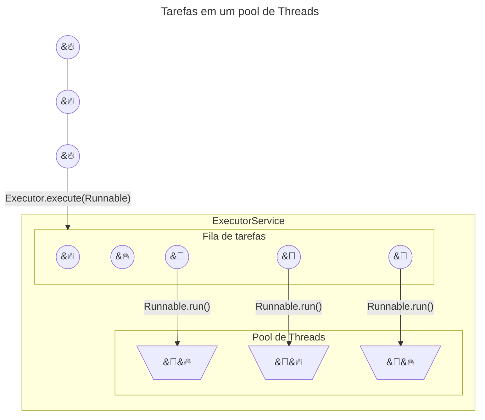

<style>
    .primary-color { color: #6db33f; }
    .center { text-align: center; }
</style>


# <span class="primary-color">Execução assíncrona (:twisted_rightwards_arrows:) e agendada (:alarm_clock:) de tarefas</span>

<div class="center">


</div>

| :seedling: Spring (`org.springframework.{core,scheduling}`) | :coffee: JDK (`java.util.concurrent`) | Função |
| --- | --- | --- |

```mermaid
---
title: Diagrama de classe de executores JDK e Spring
---
classDiagram
    class Executor["&#9749;<br>Executor"]
    <<Interface>> Executor
    Executor: +execute(runnable)

    class ThreadPoolExecutor["&#9749; &#128256;<br>ThreadPoolExecutor"]

    class ScheduledExecutorService["&#9749; &#9200;<br>ScheduledExecutorService"]
    <<Interface>> ScheduledExecutorService

    class TaskExecutor["&#127793; &#128256;<br>TaskExecutor"]
    <<Interface>> TaskExecutor
    TaskExecutor: +execute(runnable)

    class TaskScheduler["&#127793; &#9200;<br>TaskScheduler"]
    <<Interface>> TaskScheduler
    TaskScheduler: +schedule(runnable, trigger) ScheduledFuture

    class ThreadPoolTaskExecutor["&#127793; &#128256;<br>ThreadPoolTaskExecutor"]
    ThreadPoolTaskExecutor: -ThreadPoolExecutor threadPoolExecutor

    class ThreadPoolTaskScheduler["&#127793; &#9200;<br>ThreadPoolTaskScheduler"]
    ThreadPoolTaskScheduler: -ScheduledExecutorService scheduledExecutor

    Executor <|.. ThreadPoolExecutor
    Executor <|-- ScheduledExecutorService
    Executor <|-- TaskExecutor

    ThreadPoolTaskExecutor o-- ThreadPoolExecutor
    ThreadPoolTaskScheduler o-- ScheduledExecutorService

    TaskExecutor <|.. ThreadPoolTaskExecutor
    TaskScheduler <|.. ThreadPoolTaskScheduler
```

| :twisted_rightwards_arrows: `TaskExecutor`<br>:alarm_clock: `TaskScheduler` | `Executor` | Desacoplar o envio/submissão da tarefa do mecanismo execução (outra Thread, agendada, etc). |
| :twisted_rightwards_arrows: `ThreadPoolTaskExecutor`<br>:alarm_clock: `ThreadPoolTaskScheduler` | :twisted_rightwards_arrows: `ThreadPoolExecutor`<br>:alarm_clock: `ScheduledExecutorService` | Executa as tarefas dadas sobre um pool configurado. |

<div class="center">


</div>

## <span class="primary-color">`java.util.concurrent.Executor` no Spring</span>

```java
@Autowired
Executor executor;

public void processAllTasks(List<GenericSlowTask> tasks) {
    for (Runnable genericSlowTask : tasks) {
        executor.execute(genericSlowTask);
    }
}

@Bean
public TaskExecutor syncTaskExecutor() {
    return new SyncTaskExecutor();
}

@Bean
public TaskExecutor simpleAsyncTaskExecutor() {
    SimpleAsyncTaskExecutor taskExecutor = new SimpleAsyncTaskExecutor();

    // com backpressure
    taskExecutor.setConcurrencyLimit(2);

    // Sem concorrência
    // java.lang.IllegalStateException: Currently no invocations allowed - concurrency limit set to > NO_CONCURRENCY
    taskExecutor.setConcurrencyLimit(SimpleAsyncTaskExecutor.NO_CONCURRENCY);

    // Default
    // sem backpressure
    taskExecutor.setConcurrencyLimit(SimpleAsyncTaskExecutor.UNBOUNDED_CONCURRENCY);

    return taskExecutor;
}

@Bean
public TaskExecutor threadPoolTaskExecutor() {
    ThreadPoolTaskExecutor executor = new ThreadPoolTaskExecutor();

    // Default
    // Equivalente ao java.util.concurrent.Executors.newSingleThreadExecutor();
    // Todas as task compartilham uma única Thread
    executor.setCorePoolSize(1);
    executor.setMaxPoolSize(Integer.MAX_VALUE);
    executor.setQueueCapacity(Integer.MAX_VALUE);

    // Quase um java.util.concurrent.Executors.newCachedThreadPool();
    // Cria Thread adoidado por causa do MaxPoolSize.
    executor.setCorePoolSize(1);
    executor.setMaxPoolSize(Integer.MAX_VALUE);
    executor.setQueueCapacity(0);

    // Lança TaskRejectedException caused by RejectedExecutionException
    // caso não consiga executar a task por falta de Threads livres.
    executor.setCorePoolSize(1);
    executor.setMaxPoolSize(2);
    executor.setQueueCapacity(0);

    // Thread.currentThread().getName() == my-thread-pool-#
    executor.setThreadNamePrefix("my-thread-pool");
    // Limite de tempo que uma Thread, fora do tamanho do Core, pode ficar desocupada.
    executor.setKeepAliveSeconds(60);
    // AbortPolicy, DiscardPolicy, DiscardOldestPolicy, CallerRunsPolicy
    executor.setRejectedExecutionHandler(new java.util.concurrent.ThreadPoolExecutor.AbortPolicy());

    return executor;
}
```

---

## <span class="primary-color">Execução assíncrona de tarefas</span>

### <span class="primary-color">Rol de classes</span>

- `@EnableAsync`
  - Habilita o mecanismo de execução assíncrona.
  - Habilita a detecção métodos anotados com `@Async` em beans dentro do contexto IOC.
- `AsyncConfigurer`
  - Configurar um `AsyncUncaughtExceptionHandler` comum.
  - Configurar um `TaskExecutor` ou um `java.util.concurrent.Executor` para adaptar.
    - O Spring procura um bean `java.util.concurrent.Executor` de nome `taskExecutor`, ou um bean `TaskExecutor`, se não encontrar, cria um `SimpleAsyncTaskExecutor` sem limite de concorrência.
- `AsyncExecutionInterceptor`
  - Com Spring AOP, é possível interceptar a invocação de um método e torná-la assíncrona sem marca-lo com `@Async`.
- `@Async`
  - Envia/submete a execução do método para um `TaskExecutor`.
  - Permite indicar qual o `executor`, via propriedade `value`, passando o nome do Bean.

### <span class="primary-color">Assinatura de métodos `@Async`</span>

Pode ter argumentos e de retorno `void` ou `java.util.concurrent.Future`.

```java
@Async
Future<String> processTaskInParallel(int arg) {
}
```

---

## <span class="primary-color">Execução agendada de tarefas</span>

### <span class="primary-color">Rol de classes</span>

- `@EnableScheduling`
  - Habilita o mecanismo de Scheduling.
  - Habilita a detecção métodos anotados com `@Scheduled` em beans dentro do contexto IOC.
- `SchedulingConfigurer`
  - Configurar o `ScheduledTaskRegistrar`.
- `ScheduledTaskRegistrar`
  - Envia/submete `TriggerTask`, `CronTask` e `IntervalTask` à um `TaskScheduler`. E cada registro de tarefa gera sua respectiva `ScheduledTask`.
  - Atribuir um `TaskScheduler` ou um `java.util.concurrent.ScheduledExecutorService` para adaptar.
    - O Spring procura um bean `TaskScheduler` de nome `taskScheduler` ou um bean `ScheduledExecutorService`, se não encontrar, cria um `TaskScheduler` de 1 Thread só. Ou seja, a execução das tarefas fica síncrona.
- `TriggerTask`
  - Define uma tarefa (`java.lang.Runnable`) e seu gatilho de disparo (`Trigger`).
- `CronTask`
  - É uma `TriggerTask` que trabalha com o expressões `cron` usando o `CronTrigger`.
    - Para desabilitar uma tarefa, usar a expressão `ScheduledTaskRegistrar`.`CRON_DISABLED`.
- `IntervalTask`
  - Define uma tarefa (`java.lang.Runnable`) e seu intervalo de `java.time.Duration` entre os disparos.
    - Em tarefas de cadência `fixed delay`, o intervalo de `java.time.Duration` se inicia a partir do **término** (`TriggerContext`.`lastActualExecution`) da execução anterior.
    - Em tarefas de cadência `fixed rate`, o intervalo de `java.time.Duration` se inicia a partir do **início** (`TriggerContext`.`lastActualExecution`) da execução anterior.
  - É possível configurar um delay inicial antes do compasso começar.
  - Existe a `PeriodicTrigger`, mas a `IntervalTask` nem a usa.
- `Trigger`
  - Fornece o `TriggerContext` da execução anterior para ser determinado o `java.time.Instante` da próxima execução.
  - `CronTrigger` e `PeriodicTrigger` são implementações.
- `TriggerContext`
  - Fornece informações da execução e um `java.time.Clock` comum às execuções. `SimpleTriggerContext` é a implementação padrão.
    - `lastScheduledExecution`. Instante que foi agendada pela última vez.
    - `lastActualExecution`. Instante que iniciou a execução da tarefa pela última vez.
    - `lastCompletion`. Instante que completou a execução da tarefa pela última vez.
- `ScheduledTask`
  - É o retorno dos métodos de registros de tarefas no `ScheduledTaskRegistrar`.
  - Fornece método de acesso e cancelamento da `Task`.
- `@Scheduled`
  - Envia/submete a execução do método para um `TaskScheduler`.
  - Permite a configuração do compasso de agendamento via propriedades como `fixedDelay`, `fixedRate`, `timeUnit`, `cron` e `zone`, tal qual o registro de uma `TriggerTask`, `CronTask` ou `IntervalTask` no `ScheduledTaskRegistrar`.

### <span class="primary-color">`@Scheduled` síncrono Vs assíncrono?</span>

Por padrão, apenas 1 Thread é disponibilizada para o `Executor` adaptado pelo `TaskScheduler`. Ou seja, por padrão a execução das tarefas agendadas são síncronas, uma tarefa de cada vez.

Se usar `@Async` sobre o método, a execução da tarefa vai pra outra Thread e a Thread do `registrar` vai se ocupar de invocar outra `ScheduledTask` que precisa ser agendada. Como consequência, na próxima iteração de agendamento do `registrar` sobre a lista de `ScheduledTask`s, se a Thread aberta, anteriormente, não tiver sido concluída, 2 execuções da mesma tarefa começarão a existir. Caso isso seja um problema, a solução é criar um `TaskScheduler` com mais Threads.

```java
@Bean
public TaskScheduler taskScheduler() {

// Default
// Similar ao java.util.concurrent.Executors.newSingleThreadScheduledExecutor();
ThreadPoolTaskScheduler executor = new ThreadPoolTaskScheduler();
executor.setPoolSize(1);
    return executor;
}
```

### <span class="primary-color">Assinatura de métodos `@Scheduled`</span>

De retorno `void` e sem argumentos.

```java
@Scheduled(fixedDelay = 1000)
void processScheduledTask() {
}
```
