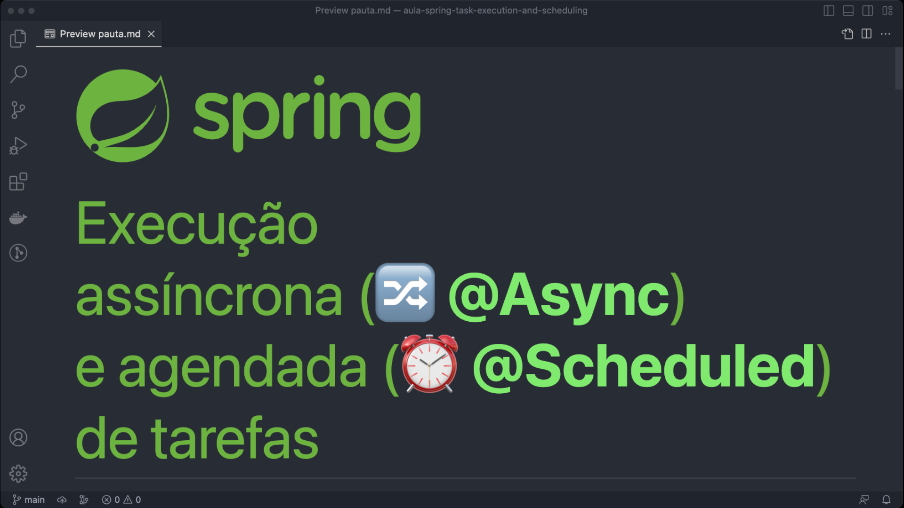

# Aulas de Spring Framework

- [Aulas de Spring Framework](#aulas-de-spring-framework)
  - [Spring Async e Java Executor](#spring-async-e-java-executor)
  - [Spring Scheduled e Lock distribuído com Redis](#spring-scheduled-e-lock-distribuído-com-redis)

## Spring Async e Java Executor

- [Pauta](./doc/async-and-scheduled-task-execution/pauta.md)
- [Código-fonte](./async-task-execution/)
- [Videoaula](https://youtu.be/yEt0TPCsLC0)

## Spring Scheduled e Lock distribuído com Redis

- [Pauta](./doc/async-and-scheduled-task-execution/pauta.md)
- [Código-fonte](./scheduled-task-execution/)
- [Videoaula](https://youtu.be/Fp-XSTYKlSA)

